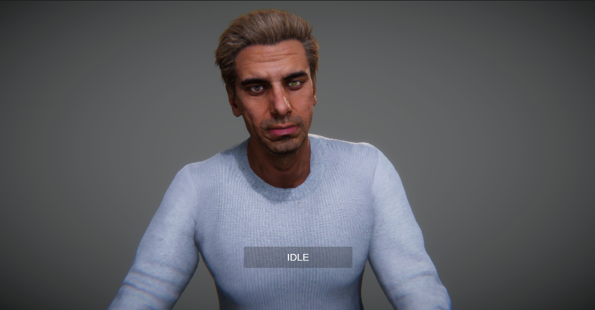

### About

Developed a real time interactive photorealistic avatar with the personality of Van Gogh. The personality is fined tuned with letters written from Van Gogh along with custom structured chunking and RAG techniques. The system is design so that developers can swap and customize the LLM and documents easily. This project is done in collaboration with ivizlab and Professor Steve Dipaola.

### Technologies Used

Unity, C#, Python, FastAPI, LangChain, AWS Poly, Salsa, CC4, iclone8, Unreal

### Responsibilities and Contributions

- Developed end-to-end pipeline and infrastructure for both Unity and Unreal Engine versions of the project.
- Implemented Speech to Text module to receive user voice input.
- Used websockets to stream back the LLM audio response from Amazon Poly.
- Implemented animation state machines and making sure animations blends properly during state transition. 
- Solved any trouble shooting issues when assisting artists integrating their assets into the system.
- Solved any raising issues with the LLM backend and served as main maintainer.
