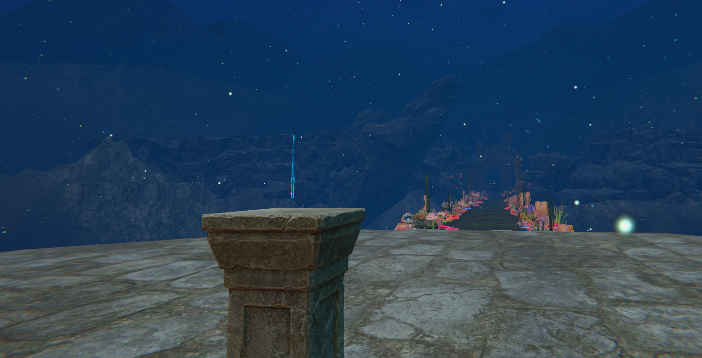
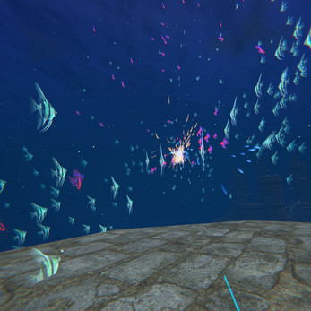
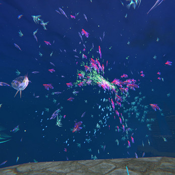
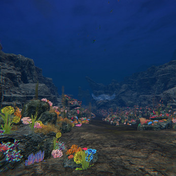
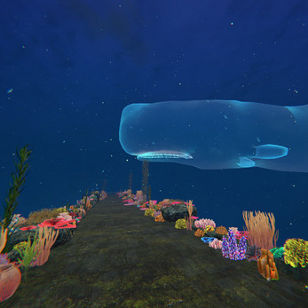

### About

Harmony VR is an interactive musical VR experience designed intentionally for users to experience wonder and awe, and hopefully a sense of self reflection. The player can tailor their own musical experience by controlling schools of fish.

### Technologies Used

Unity, C#, OpenXR

### Responsibilities and Contributions

- Implemented core VR gameplay mechanics, including boid simulation, hand presence, player locomotion, teleportation and wand interaction.
- Served as technical and creative director, project manager and programmer for this project.
- Managed a team of 5 peers with varying focused disciplines in technical art and programming, and produced a polished product in 4 months time whilst participating other high level computer science courses.
- Consistently communicated with environment and audio artists so that level design and music are cohesively iterated upon.

###  Gameplay Screen Shots

