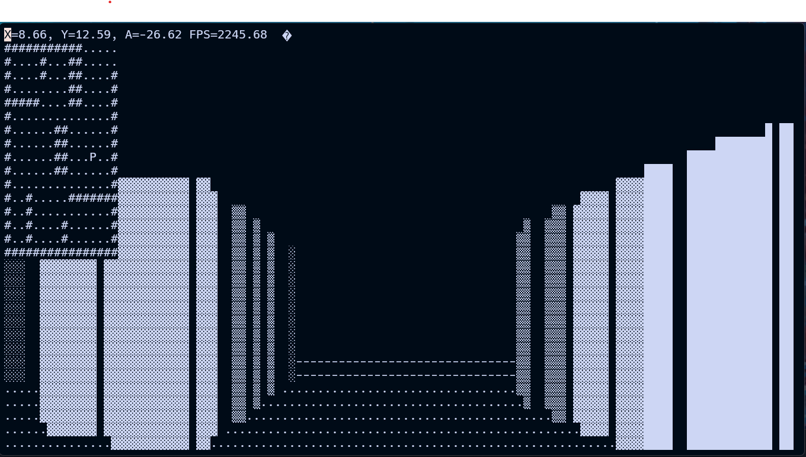
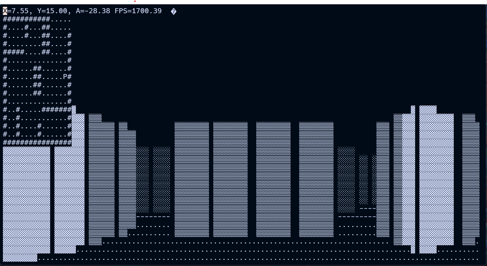
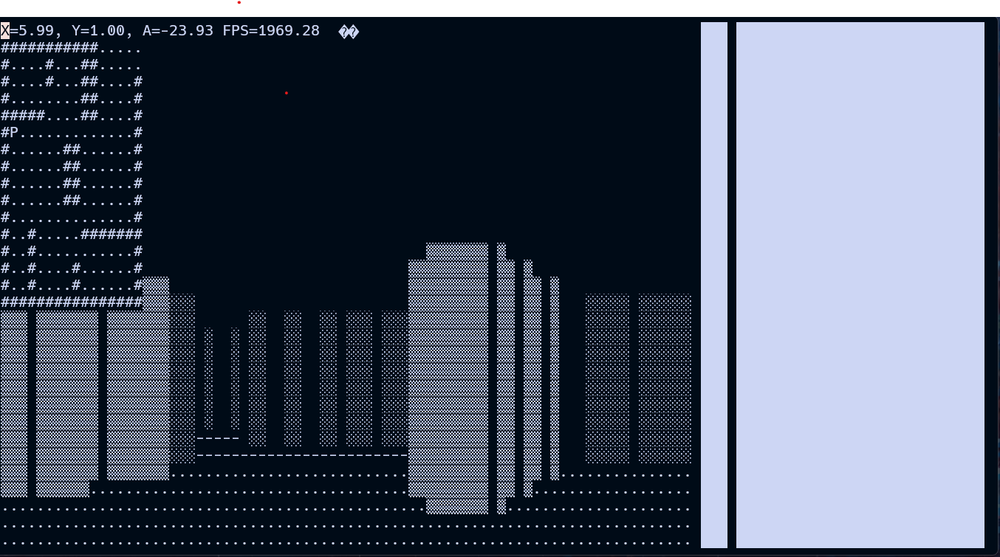

<video width="600" height="400" controls>
  <source src="/portfolio-blog-website/consolefps_demo.mp4" type="video/mp4" />
  Your browser does not support the video tag.
</video>

### About

This is a simple visual studio console project that renders a maze explorer simulator on the terminal in first person using ASCII characters.

This projects was mainly for practicing and learning linear algebra applied to a project.

### Technologies Used

C++

### Learnings

- Applied simple linear algebra and vector math to implement ray casting, wall hit/edge detection and player movement.
- Learned how to render different ASCII characters based on ray depth.
- Learned about terminal screen buffers and how to map player 2D coordinate position onto a screen buffer with a first person perspective, updating over an infinite event loop.

### Screenshots

