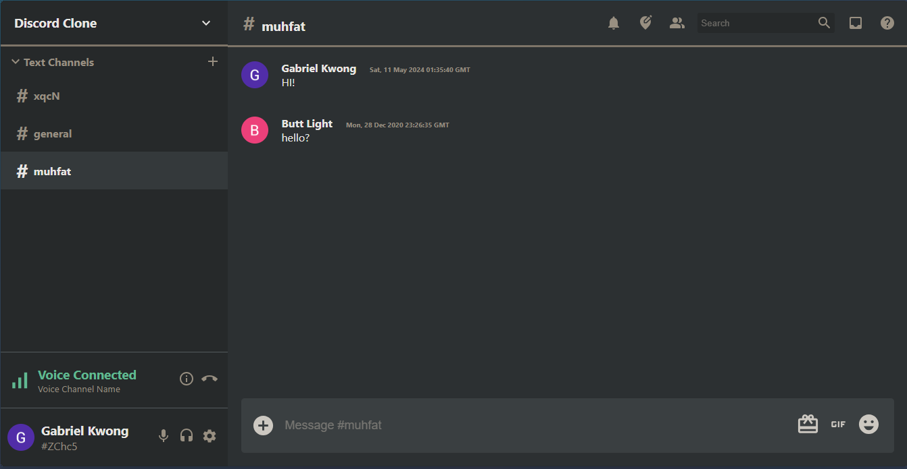

### Technologies Used

Javascript, Redux, Firebase, MaterialUI, HTML, CSS

### Learnings 

- Deployed a browser messaging application in 4 days with minimal starting experience in React, Redux and Firebase.
- Utilized firestore for storing user metadata and google authentication login (OAuth).
- Reproduced Discord aesthetic UI design using CSS and MaterialUI 

