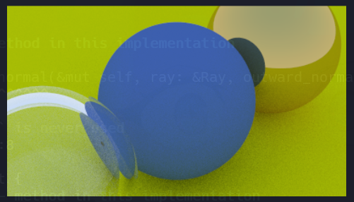
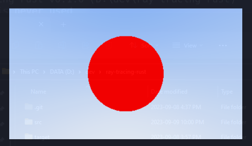
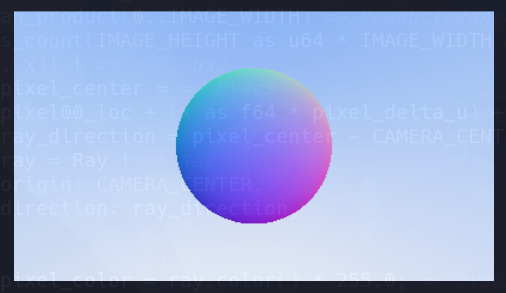
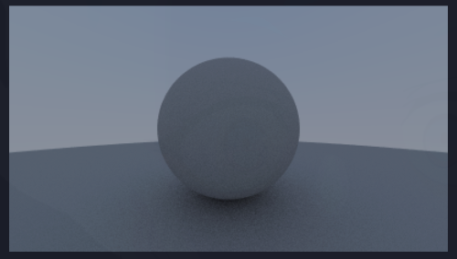
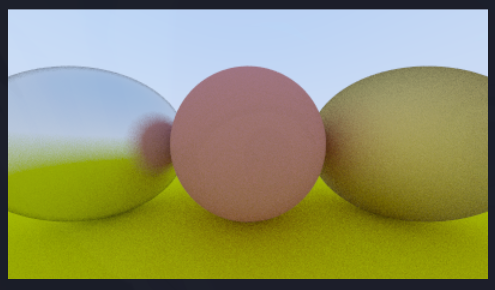
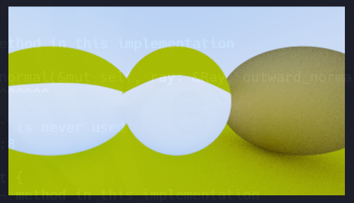

### Technologies Used

Rust, PPM image format

### Learnings

- Implemented a ray tracer from scratch following the ray tracing in one weekend series.
- Learned and implemented how ray tracing worked fundamentally.
- Implemented my own positionable camera, ray class, terminal loading bar, and materials.
- Utilized glam vector3 library from rust ecosystem instead of implementing my own, saving time!
- Implemented simple anti aliasing by generating pixels with multiple samples.
- Implemented various material solutions for diffuse, metal, and dielectric materials.
- Implemented True Lambertian Reflection to make shadows more pronounced for diffuse materials by scattering reflected rays using the Lambertian distribution.
- Used Snell's Law and Schlick Approximation to model reflections for dielectric materials.
- Learned how to write to a PPM file format to render output images.

